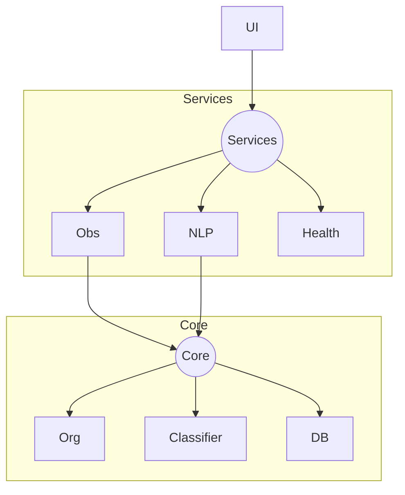

# File Organizer


---

## About

FileManager Pro is a production-grade Python application that reimagines file management through automation and intelligent organization. Built from the ground up to address real-world filesystem challenges, it combines a robust background monitoring engine with a modern interface to provide a set-and-forget solution for keeping directories organized.

At its core, FileManager Pro solves a common problem: manual file organization is tedious, error-prone, and doesn't scale. Whether you're managing downloads, project files, or media libraries, this tool automatically categorizes, monitors, and maintains your filesystem based on customizable rules. The natural language interface allows you to query and control your files conversationally, while the intelligent cleanup system identifies duplicates, orphaned files, and other inefficiencies that accumulate over time.

The project emphasizes production-ready engineering practices: modular architecture, comprehensive error handling, safe file operations with dry-run capabilities, and resilient execution even in edge cases like locked files or infinite event loops. It's designed for users who need reliability and developers who value clean, maintainable code.

---

## Table of Contents

- [Architecture](#️-architecture)
- [Technical Stack](#-technical-stack)
- [Engineering Challenges & Solutions](#-engineering-challenges--solutions)
  - [Race Conditions with File Locks](#1-race-conditions-with-file-locks)
  - [PyInstaller Packaging Issues](#2-pyinstaller-packaging-issues)
  - [Infinite Event Loops](#3-infinite-event-loops)
  - [Configuration Corruption](#4-configuration-corruption)
- [Quick Start](#-quick-start)
- [Key Features](#-key-features)
- [Contributing](#-contributing)
- [License](#-license)

---

## 🏗️ Architecture

FileManager follows a modular Service-Oriented Architecture (SOA) with clear separation of concerns:



### Layer Breakdown

- **`src/services/`** - Singleton managers handling configuration, logging, and file observation
- **`src/core/`** - Pure business logic for file operations, hashing, and NLP parsing
- **`src/gui/`** - View components built with `customtkinter`, decoupled from business logic

---

## 🔧 Technical Stack

- **File Monitoring**: `watchdog` for real-time filesystem events
- **NLP Processing**: `spaCy` with `en_core_web_sm` model
- **Data Persistence**: `SQLite` for metadata and query history
- **UI Framework**: `customtkinter` for modern dark-mode interface
- **File Integrity**: SHA-256 hashing for duplicate detection

---

## 💡 Engineering Challenges & Solutions

### 1. Race Conditions with File Locks

**Problem**: Browser downloads create temporary files (`.crdownload`) that are locked during the download process. Attempting to move these files immediately caused crashes.

**Solution**: Implemented a `FileLock` retry mechanism in `observer.py`. The system now polls and waits for file handle release before attempting filesystem operations.

```python
# Simplified example
def safe_move(src, dest, max_retries=5):
    for attempt in range(max_retries):
        try:
            shutil.move(src, dest)
            break
        except PermissionError:
            time.sleep(0.5)
```

### 2. PyInstaller Packaging Issues

**Problem**: `PyInstaller` failed to bundle the `en_core_web_sm` spaCy model and hidden imports like `babel`, resulting in runtime errors in the built executable.

**Solution**: Created custom `hook-spacy.py` and explicit hidden-import declarations in `FileManager Pro.spec` to ensure all language model vectors and dependencies are included in the bundle.

```python
# FileManager Pro.spec excerpt
hiddenimports=[
    'babel.numbers',
    'spacy.lang.en',
    # ... additional imports
]
```

### 3. Infinite Event Loops

**Problem**: Moving a file triggered a "File Modified" event, which triggered another move operation, creating an infinite recursion loop.

**Solution**: The `ObserverService` now filters out events originating from destination folders and implements a cooldown period to prevent cascading triggers.

```python
def on_modified(self, event):
    if event.src_path in self.destination_paths:
        return  # Ignore self-triggered events
    # ... process event
```

### 4. Configuration Corruption

**Problem**: The cleanup command accidentally overwrote the entire `config.json` with a partial dictionary, destroying user settings.

**Solution**: Implemented a `validate_and_merge` strategy in `config_service.py` that performs granular key updates rather than full overwrites:

```python
def update_config(self, updates):
    current = self.load_config()
    current.update(updates)  # Merge instead of replace
    self.save_config(current)
```

---

## 🚀 Quick Start

### Running from Source

```bash
# Clone the repository
git clone https://github.com/MohamedGhoniem11/File-organizer-app
cd filemanager-pro

# Install dependencies
pip install -r requirements.txt
python -m spacy download en_core_web_sm

# Run the application
python -m src.main
```

### Building Executable

```bash
# Build standalone .exe
build_exe.bat

# Output will be in dist/ folder
```

---

## 🧪 Key Features

- **Real-time Monitoring** - Instant file detection and sorting via `watchdog`
- **Natural Language Interface** - Query files with commands like "Find my PDFs" or "Cleanup downloads"
- **Smart Cleanup** - Identifies duplicates (SHA-256), orphans, and zero-byte files
- **Dry-Run Mode** - Preview cleanup operations before execution
- **Auto-Startup Integration** - Set-and-forget operation with Windows startup
- **Activity Logging** - Real-time dashboard with operation history

---

## 🤝 Contributing

1. Fork the repository
2. Create a feature branch (`git checkout -b feature/amazing-feature`)
3. Commit your changes (`git commit -m 'Add amazing feature'`)
4. Push to the branch (`git push origin feature/amazing-feature`)
5. Open a Pull Request

---

## 📄 License

This project is open source and available under the [MIT License](LICENSE).
